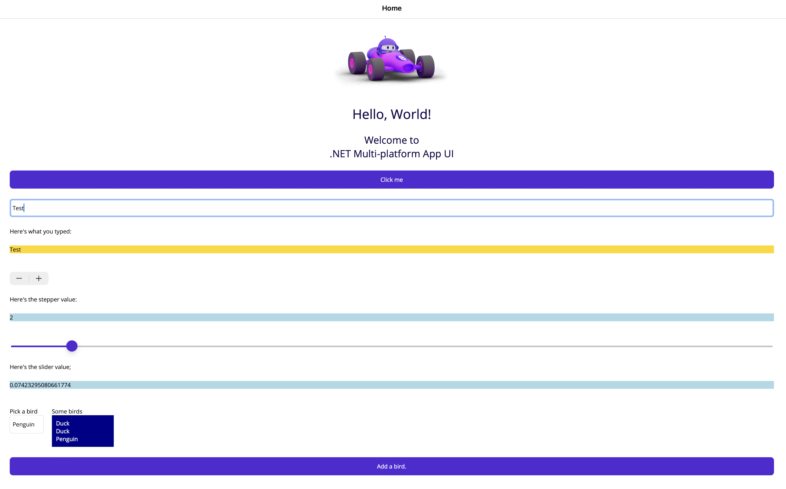
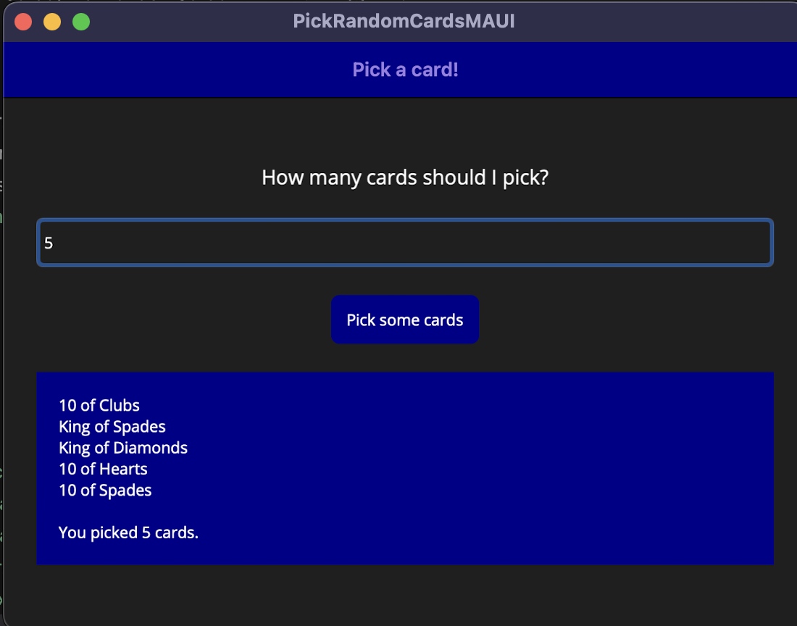

# head-first-csharp
Code and graphics for the projects in the 5th edition of Head First C#
Origin Github: https://github.com/head-first-csharp/fifth-edition


## Create new Project
```
# Create NET MAUI-App with .NET CLI
dotnet new maui -n "MyMauiApp"

# Build and start app
cd MyMauiApp
dotnet build -t:Run -f net8.0-maccatalyst
```

## MAUI Projects
### Chapter 1 - Animal Matching Game


### Chapter 2 - Experiment With Controls


### Chapter 3 - Pick Random Cards

